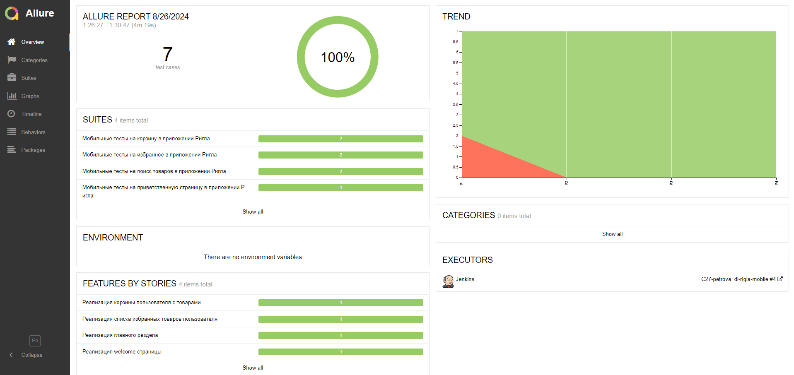
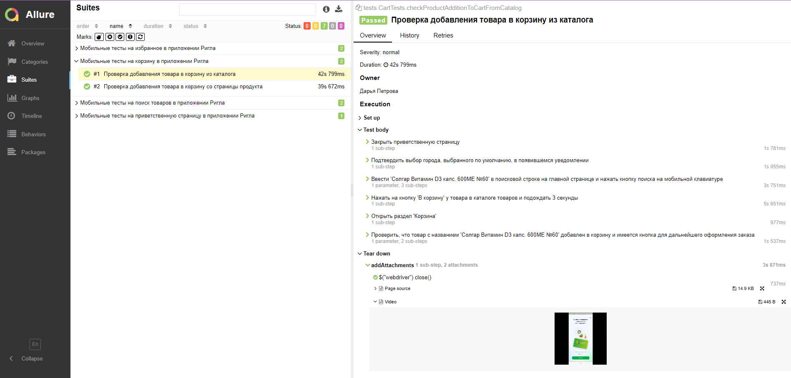
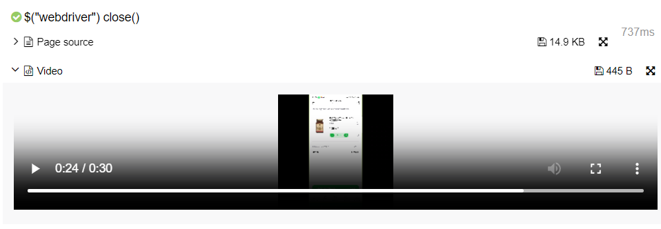
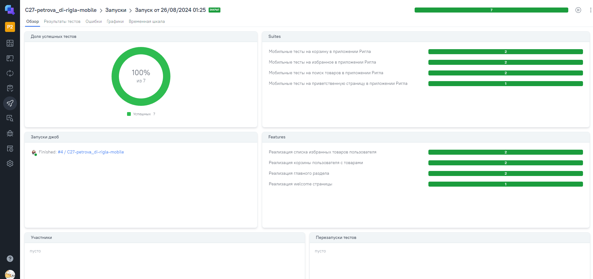
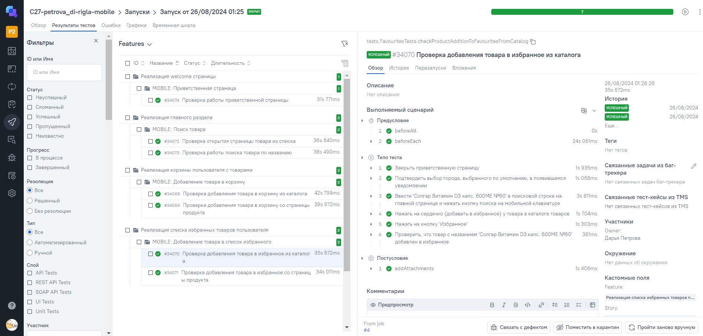
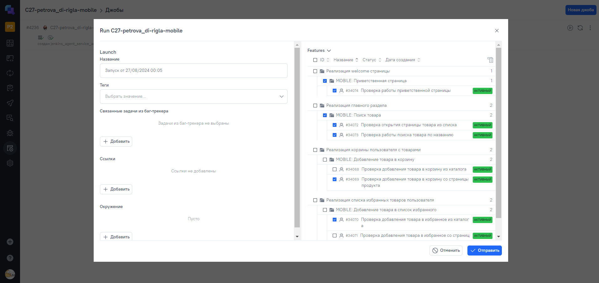
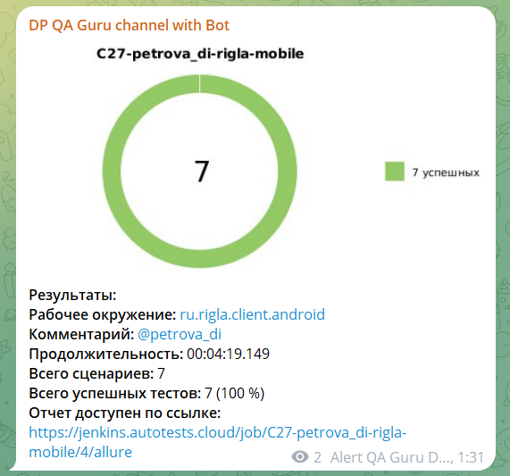
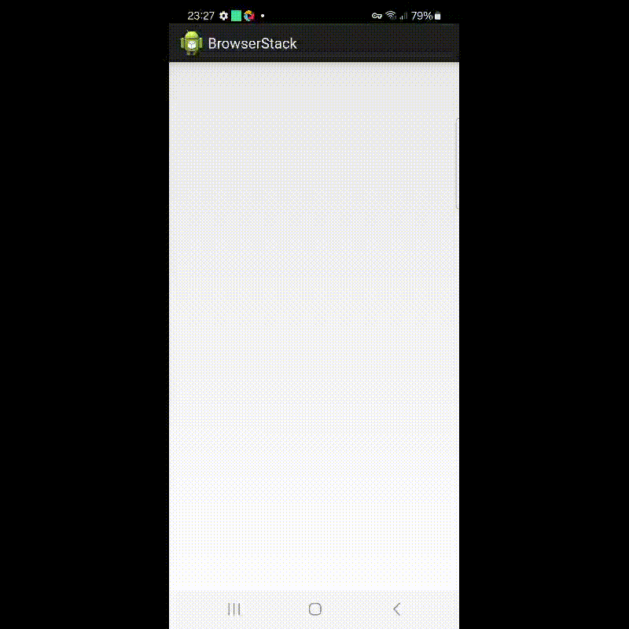

# Проект по автоматизации тестирования мобильного приложения сети аптек [](https://play.google.com/store/apps/details?id=ru.rigla.client.android&hl=ru)
>«Ригла» - сеть аптек. Большинство лекарств поставляется в аптеки сети «Ригла» крупнейшим в России фармацевтическим дистрибьютором «Протек», который закупает их напрямую у официальных производителей. «Ригла» располагает широким ассортиментом лекарственных средств, также здесь же можно найти и редкие рецептурные препараты и многое другое.

## :receipt: Содержание
- [Используемый стек](#computer-используемый-стек)
- [Описание проекта](#bookmark_tabs-описание-проекта)
- [Реализованные проверки](#heavy_check_mark-реализованные-проверки)
- [Приложение Ригла](#-приложение-ригла)
- [Запуск тестов](#large_blue_circle-запуск-тестов)
  - [Локальный запуск](#desktop_computer-локальный-запуск)
    - [BrowserStack](#-browserstack)
    - [Эмулятор](#-эмулятор)
    - [Реальное устройство](#iphone-реальное-устройство)
  - [Сборка в Jenkins](#-сборка-в-jenkins)
- [Allure-отчет](#-allure-отчет)
- [Интеграция с Allure TestOps](#-интеграция-с-allure-testops)
  - [Результаты запуска из Jenkins](#результаты-запуска-из-jenkins)
  - [Запуск из TestOps](#запуск-из-testops)
- [Уведомления в Telegram](#-уведомления-в-telegram)
- [Видео примера запуска тестов в BrowserStack](#-видео-примера-запуска-тестов-в-browserstack)


## :computer: Используемый стек
<p align="center">
<a href="https://www.jetbrains.com/idea/"></a>
<a href="https://developer.android.com/studio"></a>
<a href="https://www.java.com/"></a>
<a href="https://selenide.org/"></a>
<a href="https://www.browserstack.com/"></a>
<a href="https://appium.io/docs/en/latest/"></a>
<a href="https://github.com/allure-framework/allure2"></a>
<a href="https://qameta.io/"></a>
<a href="https://gradle.org/"></a>
<a href="https://junit.org/junit5/"></a>
<a href="https://github.com/"></a>
<a href="https://www.jenkins.io/"></a>
<a href="https://telegram.org/"></a>
</p>

## :bookmark_tabs: Описание проекта

- Проект состоит из мобильных тестов
- Автоматические тесты реализованы на языке ```Java```
- В качестве сборщика используется ```Gradle```
- Используются фреймворки ```JUnit 5``` и ```Selenide```
- Используется шаблон проектирования ```PageObject```
- Используется технология ```Owner``` для конфигурации тестов
- Реализованы драйвера для запуска тестов в ```BrowserStack```, в эмуляторе и на реальном устройстве
- Реализована возможность запуска тестов в ```Jenkins```
- Реализована возможность запуска тестов из ```Allure TestOps```
- Настроена отправка уведомлений о результатах прохождения в чат-бот ```Telegram```
- По завершении прохождения автотестов генерируется ```Allure Report```

---

## :heavy_check_mark: Реализованные проверки

:green_circle: Приветственная страница
- Проверка работоспособности приветственной страницы

:green_circle: Поиск товара
- Проверка работы поиска товара по названию
- Проверка открытия страницы товара из списка

:green_circle: Избранное
- Проверка добавления товара в избранное со страницы продукта
- Проверка добавления товара в избранное из каталога

:green_circle: Корзина
- Проверка добавления товара в корзину со страницы продукта
- Проверка добавления товара в корзину из каталога

---

##  Приложение Ригла
В BrowserStack, на эмуляторе и на реальном устройстве используется одно и то же приложение Ригла. В BrowserStack оно было загружено дополнительно. Для эмулятора и реального устройства - используется уже находящийся в репозитории проекта пакет .apk. В рамках тестов намеренно меняется язык и местонахождение, чтобы на всех устройствах использовался один и тот же язык (и как следствие, один и тот же код).

---

## :large_blue_circle: Запуск тестов

## :desktop_computer: Локальный запуск

Параметры для локального запуска в терминале IDE:
- тег/задача
  - ```test``` - все тесты
- устройство для запуска
  - ```-DdeviceHost```
    - отсутствует => запускается в BrowserStack
    - ```browserstack```
    - ```emulation```
    - ```real```

###  BrowserStack
Для запуска тестов в BrowserStack локально необходимо ввести в терминале команду
```bash
gradle clean test
gradle clean test -DdeviceHost=browserstack
```
По умолчанию, без указания окружения, тесты запускаются в BrowserStack.

###  Эмулятор
Перед запуском тестов необходимо запустить:
- эмулятор устройства в Android Studio
- Appium server

Для запуска тестов в эмуляторе необходимо ввести в терминале команду
```bash
gradle clean test -DdeviceHost=emulation
```

### :iphone: Реальное устройство
Перед запуском тестов необходимо:
- подключить к компьютеру реальное устройство (USB, Type-C)
- запустить Appium server

Для запуска тестов на реальном подключенном устройстве необходимо ввести в терминале команду
```bash
gradle clean test -DdeviceHost=real
```

:warning: Внимание! При одновременном запуске эмулятора и подключенного реального устройства, тесты запускаются на реальном устройстве и при указании ```-DdeviceHost=emulation```

##  [Сборка в Jenkins](https://jenkins.autotests.cloud/job/C27-petrova_di-rigla-mobile/)


```bash
clean test -DdeviceHost=browserstack
```

:gear: Запуск в Jenkins:
1. Открыть [сборку](https://jenkins.autotests.cloud/job/C27-petrova_di-rigla-mobile/)
2. Нажать ```Собрать сейчас```/```Build now```
3. Результат - в логах самой сборки, в Allure-отчете или в Allure TestOps

---

##  [Allure-отчет](https://jenkins.autotests.cloud/job/C27-petrova_di-rigla-mobile/allure/)
После выполнения сборки в Jenkins формируется отчет в Allure.  
В блоке ```История сборок/Build History``` напротив конкретной сборки отображается значок [](https://jenkins.autotests.cloud/job/C27-petrova_di-rigla-mobile/4/allure/), при нажатии на который открывается страница со сформированным html-отчетом и тестовой документацией.

На основной странице представлена информация о пройденных тестах, тестовые наборы, статистика проходов, распределение по функционалу.  


Переходя на страницу конкретного тестового набора, можно увидеть список всех пройденных и непройденных тестов, а также детали каждого теста.  


Помимо обычного логирования каждого шага теста, в конце каждого мобильного теста фиксируется следующая информация:  

- исходный код страницы
- видео прохождения теста (только для BrowserStack)

---

##  [Интеграция с Allure TestOps](https://allure.autotests.cloud/project/4404/dashboards)
### Результаты запуска из Jenkins
Во время выполнения сборки в Jenkins данные о запуске, тестах и результатах появляются в Allure TestOps.  
В блоке ```История сборок/Build History``` напротив конкретной сборки отображается значок , при нажатии на который открывается страница связанного запуска (вкладка "Обзор").  
  

На вкладке "Результаты тестов" можно просмотреть результат выполнения каждого теста:  


### Запуск из TestOps
Запустить тесты можно и из Allure TestOps:   
  
1. Перейти в [джобы проекта](https://allure.autotests.cloud/project/4404/jobs)
2. Нажать кнопку "Запустить джобу"
3. Задать название
4. Выбрать тесты для запуска
5. Нажать "Отправить"

---

##  Уведомления в Telegram
После завершения сборки специальный бот, созданный в ```Telegram```, автоматически обрабатывает и отправляет сообщение с отчетом о прогоне тестов.  


##  Видео примера запуска тестов в BrowserStack
Как упоминалось ранее, для каждого мобильного теста, запускаемого в BrowserStack, записывается видео его выполнения.  

